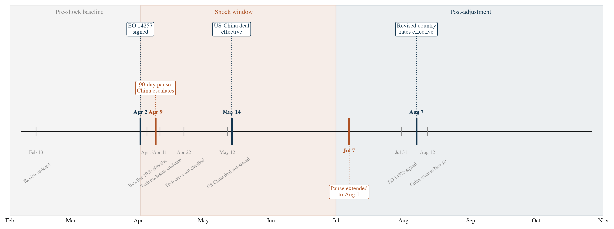
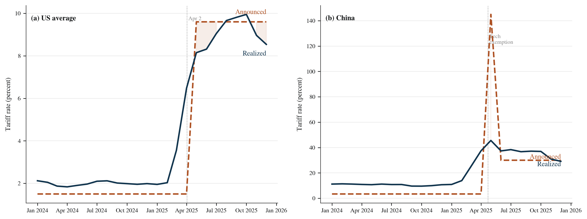
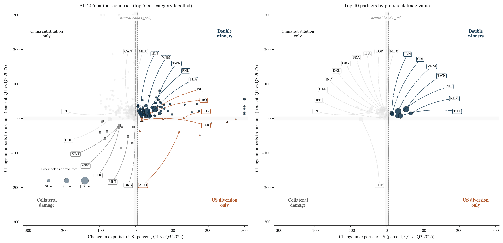
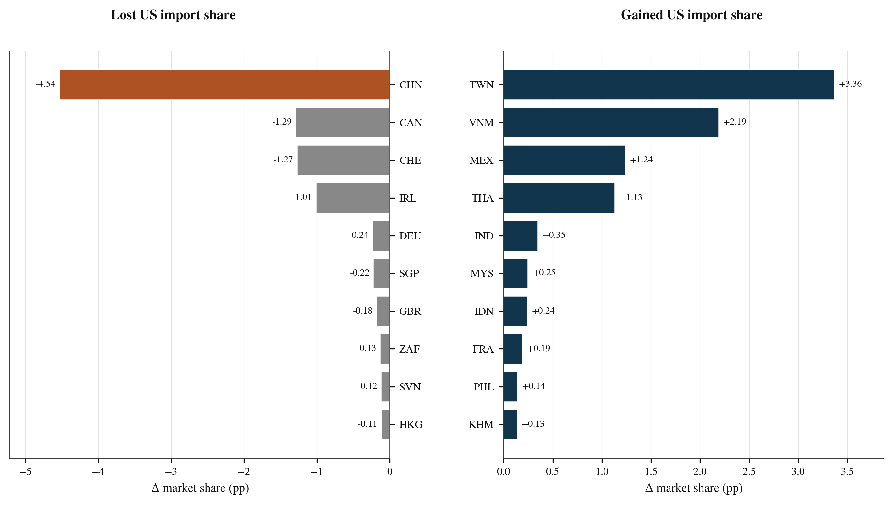
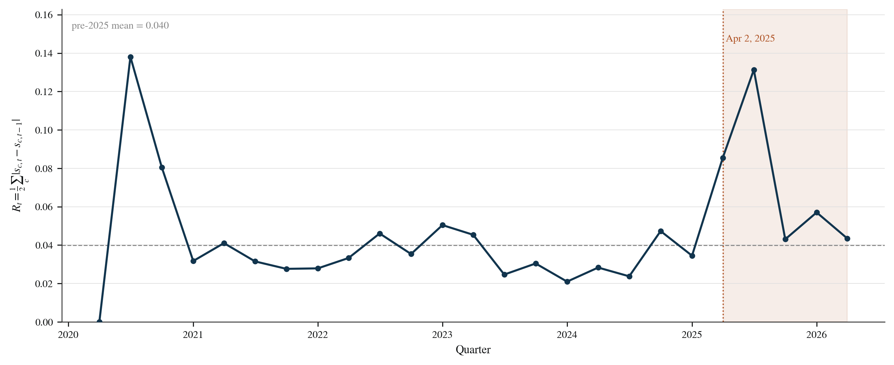
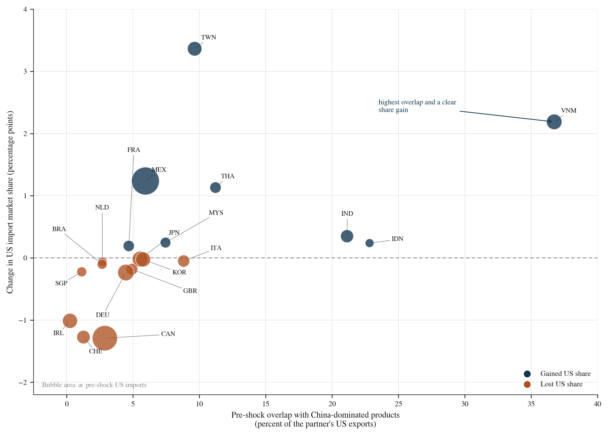
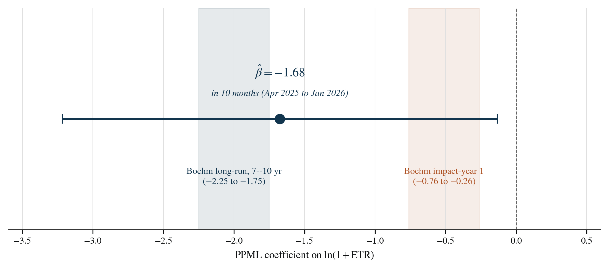
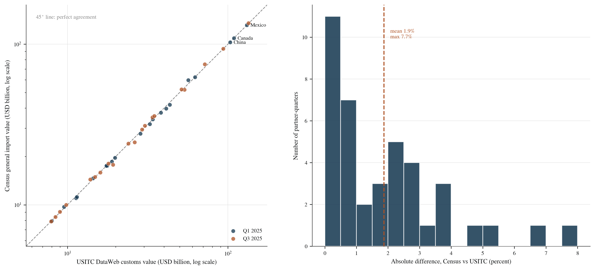

# Was Liberation a Delusion?

BSc Economics thesis, University of Amsterdam  
Çağan Oflazoğlu

This repository contains the thesis PDF, the replication pipeline, the processed public panels, the regression outputs, and the figures behind one question: when the United States called April 2, 2025 a day of economic liberation, did the customs record show that American buyers were actually made better off, or did it show that the country mostly paid higher tariffs while changing which foreign suppliers it used?

The reason the project is built around realized effective tariff rates is that the policy cannot be read only from the legal rate that was announced. A tariff written into a statement is not automatically the tariff collected at the border, because exemptions, carve-outs, grace periods, product composition, and shipment timing all stand between the announcement and the customs counter. So the repository separates the headline tariff from the tariff burden that was actually collected, and only after that asks whether trade fell, whether the fall was large, and whether the missing imports from China were replaced by production in the United States or by imports from other foreign suppliers.

[Read the thesis](thesis/finalized_main.pdf)

## What To Open First

| If you want to see | Open |
|---|---|
| Thesis | [`thesis/finalized_main.pdf`](thesis/finalized_main.pdf) |
| Data construction and regressions | [`pipeline.py`](pipeline.py) |
| Figure generation | [`figures_v2.py`](figures_v2.py) |
| Processed panels used by the paper | [`data/processed/`](data/processed/) |
| Tables and model outputs | [`outputs/`](outputs/) |
| Exported figures | [`figures/`](figures/) |

## The Evidence At A Glance

| Policy timing | Announced rate versus what customs collected |
|---|---|
|  |  |

| Trade diversion | Market-share reshuffling |
|---|---|
|  |  |

| Reallocation over time | Product exposure |
|---|---|
|  |  |

| Regression scale | Independent customs-value check |
|---|---|
|  |  |

## What The Paper Finds

The paper does not argue that the policy had no effect. The tariff burden rose, the trade data moved, and the reshuffle is visible even before waiting for a long-run equilibrium. The problem for the liberation story is where the movement seems to go. In the first ten months, the evidence looks less like a return of production to the United States and more like a tax on US firms and consumers combined with rerouting through third countries.

The average realized US import tariff rises from 1.39 percent in the 2020 to 2024 baseline to 5.68 percent in 2025. At the same time, the announced China rate reaches 145 percent, while the realized country-month rate collected at customs never goes above 70.4 percent. That gap is not a footnote, because using the announced number would make the empirical design pretend that firms faced a border rate that many goods did not actually pay.

When the realized tariff burden is used in a PPML gravity model, the main estimate is negative and statistically significant, with a coefficient of `-1.68` on `ln(1 + ETR)` in the top-40 partner specification. The market-share evidence then shows why the result should be read carefully. China loses the most US import share, while the main gains go to the next group of large third-country suppliers, including Taiwan, Vietnam, Mexico, Thailand, India, and Malaysia. In other words, part of the trade did not disappear into American production. It moved around the map.

## Repository Shape

```text
.
|-- README.md
|-- pipeline.py
|-- figures_v2.py
|-- pyproject.toml
|-- requirements.lock
|-- thesis/
|   `-- finalized_main.pdf
|-- data/
|   `-- processed/
|-- outputs/
`-- figures/
```

The repository is intentionally narrower than the private working folder. It publishes the thesis, the code, the figures, the public processed panels, and the output tables needed to inspect the results, while raw archives, private drafts, access keys, literature PDFs, and restricted-data products are left out.

## Reproducing The Public Pipeline

The pipeline is written for Python 3.12, with dependencies pinned in `requirements.lock`. A first full run can take a while because the script downloads public data, waits between rate-limited requests, builds the panels, runs the regressions, and exports the figures. Later runs are faster because raw downloads are cached locally.

```bash
python -m venv .venv
source .venv/bin/activate
pip install -r requirements.lock

python pipeline.py run
python pipeline.py regress
python figures_v2.py
```

The public replication route uses IMF, US Census, Yale Budget Lab, CEPII, IMF WEO, OECD, and USITC sources. Some HS6 product-detail calls may work better with a free Census API key stored locally, but no key is included in this repository. The Teti Global Tariff Database is treated separately because its access conditions are not the same as the public sources. If you have access, place the archives manually in `data/raw/` and the optional Teti checks can be regenerated; if you do not, the main Census realized-ETR results still run without those files.

## Data Availability

| Source | Role in the paper | Public release treatment |
|---|---|---|
| IMF Direction of Trade Statistics | Monthly bilateral trade flows | Rebuilt by the pipeline from public SDMX endpoints |
| US Census Bureau | Imports, customs duties, and product detail | Rebuilt by the pipeline from public API calls |
| Yale Budget Lab Tariff Tracker | Announced tariff-rate path | Rebuilt by the pipeline from the public tracker file |
| CEPII Gravity and GeoDist | Gravity controls | Rebuilt by the pipeline from public CEPII files |
| IMF World Economic Outlook | GDP controls | Rebuilt by the pipeline from public IMF files |
| OECD Quarterly National Accounts | Macro extension data | Rebuilt by the pipeline from public OECD endpoints |
| USITC DataWeb | Independent customs-value validation | Public validation output is included |
| Teti Global Tariff Database | Optional product-weighted applied-tariff checks | Raw files and derived restricted-data tables are not redistributed |

The processed files included here are the public-side panels and tables used to explain the thesis result. The raw data are deliberately not committed, partly because they are re-downloadable and partly because not every source carries the same redistribution permission. That is also why the Teti archives, direct access links, and Teti-derived CSV outputs are outside the public release.

## Main Files

| Path | What it contains |
|---|---|
| [`pipeline.py`](pipeline.py) | Download, cleaning, panel construction, regressions, and report commands |
| [`figures_v2.py`](figures_v2.py) | Matplotlib figure factory for all thesis figures |
| [`data/processed/gravity_event_study_panel.csv`](data/processed/gravity_event_study_panel.csv) | Main country-month gravity panel |
| [`data/processed/realized_etr_by_country_month.csv`](data/processed/realized_etr_by_country_month.csv) | Census realized tariff burden by partner and month |
| [`data/processed/trade_diversion_indicators.csv`](data/processed/trade_diversion_indicators.csv) | Partner-level diversion and overlap measures |
| [`outputs/regression_coefficients.csv`](outputs/regression_coefficients.csv) | Main coefficient table in machine-readable form |
| [`outputs/regression_results.txt`](outputs/regression_results.txt) | Main PPML regression output |
| [`outputs/usitc_census_discrepancy.csv`](outputs/usitc_census_discrepancy.csv) | Census versus USITC validation comparison |

## Limits

The post-shock window is short, so the results should not be read as the final long-run welfare answer. Country-month realized tariff rates also average across products, which means sector-level differences are partly hidden, and the diversion evidence observes customs origin and product overlap rather than the physical journey of every shipment. Still, those limits do not erase the main pattern. The available evidence can show that realized tariffs rose, that imports fell more where the collected tariff burden was higher, and that the first visible reshuffle mostly favored other foreign suppliers rather than domestic production.

## Citation

Oflazoğlu, Ç. (2026). *Was Liberation a Delusion? Liberation Day Tariff Shocks, Bilateral Trade Flows, and Trade Diversion in 2025.* BSc thesis, University of Amsterdam, Faculty of Economics and Business.

## Contact

Çağan Oflazoğlu  
University of Amsterdam, Faculty of Economics and Business  
cagan.oflazoglu@student.uva.nl
